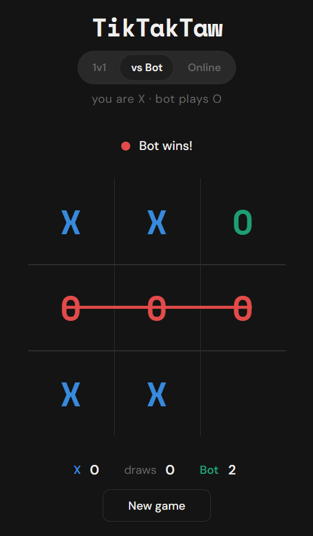

# TikTakTaw (Tic-Tac-Toe with Minimax Bot + Online Multiplayer)

Free to use Tic‑Tac‑Toe game built with React + Vite. 

[Try TikTakTaw Now!](https://baceksgit.github.io/TikTakTaw/)

## Screenshot

<p align="center">
  
</p>

**Author:** Baceks  
**Created:** March 11, 2026 (GMT+8)

## Features

- **Three modes:** `1v1` (local), `vs Bot` (minimax AI), and `Online` (PeerJS / WebRTC).
- **Online rooms:** Create a room and share a link or room code (no account needed).
- **Themes:** System / Light / Dark toggle.
- **Polish:** Win line animation, scoreboard, and “Bot is thinking…” state.

## How to Play

- Click a cell to place your mark.
- Get 3 in a row to win.
- Click **New game** to reset the board (scores stay).
- Switching modes resets everything (board + scores).

### Online (PeerJS)

- Choose **Online** -> **Create room** to host (you play as **X** and go first).
- Share the invite link (or **room code**) with your friend.
- Your friend chooses **Online** -> **Join room** and enters the room code (or opens the shared link).

## Getting Started

### Prereqs

- Node.js (recommended: Node 18+)

### Install

```bash
cd TikTakTaw
npm install
```

### Run (dev)

```bash
npm run dev
```

### Build

```bash
npm run build
npm run preview
```

## Project Structure

- `src/App.jsx` – app layout + wiring
- `src/components/` – UI components (board, toggles, status, score row)
- `src/hooks/` – game + theme hooks
- `src/logic/` – win checking + bot AI
- Online multiplayer: `src/hooks/usePeer.js`, `src/components/OnlineModal.jsx`, `src/components/WaitingRoom.jsx`

## Troubleshooting

### PowerShell: “running scripts is disabled” when running `npm`

If Windows PowerShell blocks `npm.ps1`, either:

- Run commands via `cmd.exe`, or use `npm.cmd` (example: `npm.cmd run dev`), or
- Change your execution policy for the current user (only if you understand the impact):
  `Set-ExecutionPolicy -Scope CurrentUser RemoteSigned`
